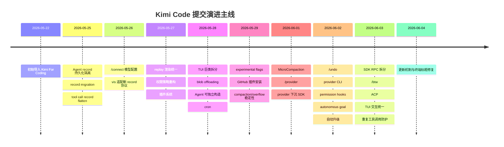

# Kimi Code Commit 历史分析

本文基于当前 `main` 分支的 Git 历史快照编写。当前仓库共有 186 个提交，时间跨度从 2026-05-22 的初始提交 `842e699` 到 2026-06-04 的最新提交 `d645d7e`。整体看，这是一个非常年轻但迭代密度很高的项目：不到两周内完成了 CLI/TUI、agent-core、SDK、插件、MCP/ACP、可视化调试、自动升级、goal/cron 等多条主线的快速成型。

## 1. 全量提交概览

### 1.1 时间分布

| 日期 | 提交数 | 主要节奏 |
| --- | ---: | --- |
| 2026-05-22 | 2 | 初始导入和 README 小修。 |
| 2026-05-25 | 16 | record 协议、compaction、OAuth、shell/TUI 修复开始密集迭代。 |
| 2026-05-26 | 26 | `/connect`、vis 协议重写、认证/模型配置、wire 兼容性和 TUI 修复。 |
| 2026-05-27 | 20 | replay、导出、权限策略、插件系统、stream timing。 |
| 2026-05-28 | 23 | TUI 拆分、blob offloading、Agent 构造边界、cron、provider 抽象。 |
| 2026-05-29 | 32 | feature flag、插件 GitHub 安装、context overflow、模型环境变量、release 0.6。 |
| 2026-05-30 | 2 | adaptive thinking 与用户中断语义。 |
| 2026-06-01 | 9 | MicroCompaction、`/provider`、Nix CI、provider 下沉 SDK。 |
| 2026-06-02 | 34 | `/undo`、provider CLI、permission hooks、goal、自动升级、release 0.8。 |
| 2026-06-03 | 19 | SDK RPC 拆分、`/btw`、ACP、大规模 TUI 交互统一、循环检测、release 0.9。 |
| 2026-06-04 | 3 | 自动更新修复、终端标题修复、文档更新。 |

### 1.2 类型分布

| 类型 | 数量 | 说明 |
| --- | ---: | --- |
| `fix` | 77 | 占比最高，说明项目处于快速产品化和稳定性打磨期。 |
| `feat` | 49 | 新能力密集：插件、cron、goal、provider、ACP、升级等。 |
| `docs` | 19 | 文档和 changelog 随 release 高频同步。 |
| `refactor` | 15 | 主要集中在 agent-core 边界、TUI 巨类拆分、SDK RPC。 |
| `ci` | 12 | release、Nix、pkg preview、native bundle 等工程化。 |
| `chore` | 8 | changeset、flake、文本清理、workspace 维护。 |
| `test` | 3 | 测试基础设施和确定性修正。 |
| `perf` | 1 | TUI 渲染性能优化。 |

### 1.3 贡献分布

提交数最多的作者集中在 `_Kerman`、`liruifengv`、`qer`、`Haozhe`、`7Sageer`。从主题上看：

- `_Kerman`：agent-core、record 协议、compaction、subagent、SDK/RPC、运行时边界。
- `liruifengv`：TUI、CLI、更新机制、导出、交互体验和视觉规范。
- `qer`：插件、hooks、文档、公开文本清理。
- `Haozhe`：cron、provider、ACP、Nix/release、循环检测。
- `7Sageer`：provider 连接、模型 thinking、tool call id、CLI provider。

## 2. 演进主线

整体演进有几个明显阶段：

1. **初始成型期**：`842e699` 一次性导入完整 monorepo，包括 CLI/TUI、agent-core、node-sdk、kosong、kaos、vis、docs、release 和 native 打包。
2. **记录协议与恢复能力硬化期**：5 月 25 日到 5 月 27 日围绕 `wire.jsonl`、record migration、tool call 记录、replay、vis 协议重写做了大量修改。
3. **扩展能力期**：插件、skills、MCP、cron、provider、feature flags 在 5 月 27 日到 6 月 1 日集中落地。
4. **自动化 agent 能力期**：MicroCompaction、goal、background ask user、permission hooks、重复工具调用防护，把 agent 从单轮交互推向长任务自治。
5. **外部接入与产品化期**：ACP、provider CLI、自动升级、TUI 统一交互、Windows/终端兼容性修复，使项目更像可发布产品而不是内部原型。

## 3. 核心 Commit 解读

### 3.1 `842e699` - `Kimi For Coding`

这是初始导入提交，规模极大，奠定了整个项目的基本形态：

- 建立 TypeScript monorepo：`apps/kimi-code`、`apps/vis`、`packages/agent-core`、`packages/node-sdk`、`packages/kosong`、`packages/kaos`、`packages/oauth`、`packages/telemetry`。
- 初始 CLI/TUI 已经很完整，包括 `main.ts`、`run-shell`、`run-prompt`、大量 TUI 组件、dialogs、reverse RPC、工具渲染和测试。
- 初始 core 已包含 Agent、Session、tools、MCP、skills、records、compaction、permission、RPC 等主体。
- 同时引入 docs、changesets、native build、release workflow、Nix、CI、测试体系。

这个提交不是简单 scaffold，而是一个接近可运行产品的初版。后续 185 个提交主要是在这个骨架上重构边界、补能力、修稳定性。

### 3.2 `0da6073` - 隔离 Agent Record 持久化

`refactor: isolate agent record persistence (#14)` 把 agent record 的写入持久化从原先具体 wire 文件实现中抽出，新增 `packages/agent-core/src/agent/records/persistence.ts`，删除旧的 `wire-file.ts`。

意义：

- 把“记录什么”和“怎么写入文件”解耦。
- 为后续 record migration、blob offloading、vis 读取协议提供更稳定的边界。
- 增加大量 persistence 测试，说明 record 是这个项目恢复和调试能力的基础设施。

### 3.3 `2004aed` - Agent Record Migration

`feat(agent-core): add agent record migrations (#22)` 引入 record migration 体系和 wire version 格式。

意义：

- `wire.jsonl` 成为可演进协议，而不是一次性内部日志。
- 老会话可以被新版本读取和迁移，降低协议变更对恢复、vis、导出的破坏。
- 后续 `v1.1`、`v1.2`、`v1.3` migration 都建立在这个基础上。

### 3.4 `c4dd1c7` - Flatten Tool Call Records

`feat: flatten tool call records (#25)` 修改 88 个文件，新增 `v1.1` migration。

意义：

- 工具调用记录从复杂嵌套形态变得更扁平，利于 replay、vis、导出和测试断言。
- 这类 record schema 变更会影响 core、TUI、SDK、kosong 测试，说明工具调用是整个系统的中轴数据。
- 它也解释了为什么后面要持续维护 record migration。

### 3.5 `a200a29` - `/connect` 与模型目录

`feat(kimi-code): add /connect command with bundled model catalog (#30)` 引入 models.dev 风格 catalog，跨三层实现：

- `kosong`：catalog schema、能力推断、wire type 推断。
- `node-sdk`：fetch/apply catalog，写入配置。
- `apps/kimi-code`：TUI `/connect` 流程和选择器。

意义：

- 用户不再必须手写 provider/model 的上下文窗口、能力等元数据。
- 模型/provider 配置从“手工配置文件”开始产品化。
- 这个能力后来被 `/provider` 和 `kimi provider` 取代或统一，但它是 provider 管理主线的起点。

### 3.6 `c0b63c1` - Vis 适配新 Agent-Core 协议

`refactor(vis): rewrite for new agent-core protocol (#34)` 删除旧 wire 协议相关代码，重写 `apps/vis` 对新 agent record 的读取和展示。

意义：

- `vis` 不再是临时查看器，而是紧跟 agent-core wire protocol 的调试面。
- agent-core re-export wire record types，说明 vis 是 monorepo 内部的一等消费者。
- 新增 session store reader、wire/context/subagent API 和大量测试，使可视化调试能随着 record 协议长期演进。

### 3.7 `ce420bf` - Resume Replay 渲染统一

`refactor(tui): unify resume replay rendering (#88)` 删除旧 `replay-ops.ts`，新增 `message-replay.ts`。

意义：

- TUI 恢复历史会话时，不再维护一套和 live render 不一致的渲染逻辑。
- 修复计划审查、工具组、最终 approved plan 等 replay 表达。
- 这类改动对用户体验很关键：会话恢复必须像真实历史，而不是只恢复文本。

### 3.8 `2b74025` - 权限策略重构

`feat: rework permission decision policies (#26)` 重构 permission policy，并新增 `v1.2` record migration。

意义：

- 权限判断从默认策略文件迁移到更明确的规则匹配和路径 glob 支持。
- 影响工具执行安全边界，是 agent 能否安全自动操作文件/shell 的核心。
- 后续 permission approval hooks、ACP approval、auto/yolo 都依赖这条主线。

### 3.9 `ebf6e81` - 插件系统与官方插件

`feat: add plugin manager and official plugins (#119)` 引入 plugin manager、marketplace 和官方 `kimi-datasource` 插件。

意义：

- 项目从固定内置功能扩展到插件式能力。
- 插件可以提供 skills、MCP 或 session start 注入，成为核心扩展机制。
- marketplace、plugin store、RPC、TUI 命令和官方插件同时落地，说明这是产品级功能而不是实验性脚本。

### 3.10 `dad2b87` - 拆分 TUI 巨类

`refactor(tui): split kimi-tui God-class into controllers and command modules (#142)` 把 `KimiTUI` 中的任务浏览、流式 UI、事件处理、session replay、键盘、认证等拆成 controllers。

意义：

- 初始 `kimi-tui.ts` 超过 6000 行，维护成本高。
- 拆分后 TUI 的职责边界更清楚：主控制器协调状态，具体流程由 controller 负责。
- 这个提交直接改善后续新增 `/provider`、`/btw`、dialog 统一交互等功能的可维护性。

### 3.11 `a6d379b` - 大媒体 Blob Offloading

`feat: offload large base64 media payloads to external blob files (#117)` 新增 blob reference、`BlobStore`、vis blob route 和 `v1.3` migration。

意义：

- 防止大 base64 图片/视频塞进 `wire.jsonl`，避免记录文件膨胀和 replay/vis 卡顿。
- 把 wire record 从“所有内容内联”演进为“结构化事件 + 外部 blob 引用”。
- 对多模态输入、导出、会话恢复和可视化调试都是基础性优化。

### 3.12 `28d2b5c` 与 `b5981a5` - Agent 可独立构造与 ModelProvider

`refactor(agent-core): make Agent constructable and consolidate provider-manager (#161)` 和 `feat(agent-core): ModelProvider interface and SingleModelProvider (#167)` 是一组架构边界提交。

意义：

- `Agent` 不再强依赖 `Session` 生命周期，构造时通过 options 注入 `kaos`、provider、MCP、skills、hooks 等能力。
- provider manager 被合并到 session 层，模型提供能力通过 `ModelProvider` 接口抽象。
- `SingleModelProvider` 让测试或外部宿主能用单模型运行 Agent。
- 这符合仓库规则里强调的原则：`Agent` class 必须能独立使用，不能强迫调用者创建 `Session`。

### 3.13 `971fce6` - Session-Scoped Cron

`feat(agent-core): add session-scoped cron tools with persistence (#157)` 新增 cron scheduler、表达式解析、持久化、工具和测试。

意义：

- agent-core 开始支持定时任务，不再只响应用户即时 prompt。
- cron 是 session-scoped，说明它和会话状态、持久化、恢复紧密关联。
- 后续 TUI 渲染 scheduled reminders、cron fired events 都建立在这个 core 能力上。

### 3.14 `96bbc47` - Experimental Feature Flags

`feat: add experimental feature-flag system (#205)` 引入中央 flag registry，按环境变量控制实验功能。

意义：

- 新功能可以默认关闭，通过 `KIMI_CODE_EXPERIMENTAL_<NAME>` 或总开关启用。
- SDK 只暴露 flag 类型和 resolved snapshot，不把 core runtime singleton 泄漏到宿主。
- 插件系统一开始就被 flag gate，体现项目对实验能力发布节奏的控制。

### 3.15 `bab2da7` - 从 GitHub 安装插件

`feat(plugin): install plugins from a GitHub repository URL (#221)` 增加 `github` plugin source kind。

意义：

- 插件安装从本地路径/zip URL 扩展到 GitHub repo URL。
- 支持 release tag、branch、子目录等解析路径，降低插件分发门槛。
- 同时限制 trust badge，说明插件来源可信度开始成为产品设计的一部分。

### 3.16 `1084f1d` - MicroCompaction

`feat: implement MicroCompaction (#219)` 新增 `agent/compaction/micro.ts` 和独立测试。

意义：

- full compaction 之外增加更细粒度的上下文压缩策略。
- 能在长对话或工具密集场景下降低上下文压力。
- 这条线和后续 output budget、context overflow 恢复、TODO list 注入 compaction summary 形成一组上下文管理能力。

### 3.17 `42bb914` 与 `3c5dee8` - Provider 管理产品化

`feat(tui): add /provider command, custom registry import, and tabbed model selector (#264)` 把早期 `/connect` 统一为 `/provider` 流程：

- Provider CRUD UI。
- 自定义 registry 导入。
- 按 provider 分组的 tabbed model selector。
- 启动时后台刷新 provider model。

随后 `feat(cli): add kimi provider subcommand (#313)` 提供非交互 CLI 版本：

- `kimi provider add <url> --api-key <key>`
- `kimi provider remove <id>`
- `kimi provider list [--json]`

意义：

- provider 管理由 TUI 内功能扩展为可脚本化 CLI 功能。
- 同一套配置能力同时服务交互用户和自动化/CI 用户。
- 这是模型供应商接入从“配置文件工程问题”转成“产品功能”的节点。

### 3.18 `ab54641` - Kimi for Coding Provider 下沉到 SDK

`refactor: move Kimi for Coding provider to SDK (#281)` 新增 `packages/node-sdk/src/kimi-code-model-provider.ts`。

意义：

- `agent-core` 保持通用 agent engine，不持有 Kimi Code 产品专用 provider 细节。
- SDK 作为产品宿主门面，承接 Kimi for Coding provider。
- 这强化了 `agent-core` 与产品外壳之间的边界。

### 3.19 `a217ff0` - `/undo` 与 Replay 同步

`feat: add /undo slash command and keep replay in sync (#277)` 增加撤销命令、SDK RPC、agent-core undo history 支持和 TUI transcript metadata。

意义：

- 用户可以撤销历史上下文，而不是只能继续追加。
- record/replay 必须同步更新，否则恢复后的会话会和现场状态不一致。
- 这是对“会话是可编辑历史”能力的一次推进。

### 3.20 `7cda9c3` - Permission Approval Hooks

`feat: add permission approval hooks (#336)` 在 permission manager 和 session hooks 里增加 approval hook。

意义：

- 权限审批不只是 UI 弹窗，还能被 hooks 观察或参与。
- 为企业/自动化场景提供审计或策略扩展点。
- 与后续 ACP approval 映射共同构成跨宿主权限处理机制。

### 3.21 `ac37d74` - 自主 Goal 模式

`feat: pursue a goal autonomously (#270)` 引入 goal store、goal tools、goal panel、goal continuation、预算与完成状态。

意义：

- agent 从“用户发一条 prompt，执行一轮”扩展为“围绕目标多轮自主推进”。
- 增加 `CreateGoal`、`UpdateGoal`、goal budget、goal completion message 等工具和状态。
- 这是本项目最重要的 agent 行为演进之一，后续预算 schema、output caps、goal UI 都围绕它完善。

### 3.22 `a6b16ce` - 拆分 SDK RPC Client

`refactor: split SDK RPC client (#339)` 新增 `packages/node-sdk/src/sdk-rpc-client.ts`，把 RPC client 从更大的 SDK 模块中拆出。

意义：

- SDK 内部边界更清楚：RPC client 负责连接 core，`KimiHarness` 负责宿主门面，SDK `Session` 负责单会话 API。
- 让 ACP、CLI 和测试更容易复用 SDK。
- 这是后续外部接入前的重要整理。

### 3.23 `3eafa79` - ACP Server 与 IDE 集成

`feat(acp): implement ACP server with session lifecycle, tool streaming, and IDE integration (#368)` 是近期最大提交之一，新增 `packages/acp-adapter` 包和 `kimi acp` 命令。

它实现了：

- ACP version negotiation。
- session new/list/load/resume/cancel/prompt。
- 历史 replay。
- assistant/thinking/tool call/tool result streaming 映射。
- approval、AskUserQuestion、plan updates。
- MCP server forwarding。
- 模型、模式、thinking config options。
- IDE 文档和大量 e2e/协议测试。

意义：

- Kimi Code 不再只面向自己的 TUI，也能作为 ACP agent 接入 IDE 或外部客户端。
- 这验证了此前 SDK/Core 分层的价值：ACP 主要通过 `KimiHarness` 复用已有会话能力。
- 它也推动了 MCP config merge、登录流、stdout-safe logging 等跨层细节完善。

### 3.24 `ba7dd73` - `/btw` Side-Channel Command

`feat: add btw side-channel command (#338)` 增加 `/btw` 命令、side panel、controller，以及 core 侧 side-channel/subagent 支持。

意义：

- 用户可以在主会话旁启动一个侧向 agent 通道。
- 增加 `deny-all` permission policy，说明 side-channel 默认权限更保守。
- 这扩展了 TUI 的多任务/并行上下文表达，也对 session/subagent 设计提出更高要求。

### 3.25 `90879f3` - 统一 TUI Dialog 交互与视觉

`feat(cli): unify TUI dialog interaction and visuals (#363)` 统一 list dialog、selector、provider manager、model selector、plugins selector 等交互规范，并新增 `.agents/skills/write-tui`。

意义：

- TUI 从“功能可用”进入“交互一致性”阶段。
- 新增设计规范技能，说明后续 TUI 改动要按明确 spec 走。
- 对一个终端产品来说，这类提交能显著降低用户学习成本和维护分歧。

### 3.26 `9e69724` - 重复工具调用防护

`feat(agent-core): detect and escalate repeated tool calls to prevent infinite loops (#364)` 在 `TurnFlow` 的工具调用去重/检测里加入重复调用阶梯提醒和强制停止。

意义：

- agent 可能陷入重复调用同一个工具的死循环，这个提交把行为从被动等待转成主动检测。
- 在 streak 3、5、8 注入提醒，在更高阈值强制停止，并发出 telemetry。
- 这是 agent 安全性和成本控制的重要保护。

### 3.27 `d645d7e` - 自动更新后台安装修复

`fix(update): start automatic installs after fresh version checks (#403)` 修正自动更新在 fresh version check 后没有启动安装的问题。

意义：

- 自动升级机制属于产品发布闭环；如果检测到新版本但没有启动安装，用户会停在旧版本。
- 修改集中在 `apps/kimi-code/src/cli/update/preflight.ts` 和测试，说明更新预检逻辑已经被细粒度测试覆盖。
- 这是 6 月 4 日最新稳定性修复之一。

## 4. Release Commit 节奏

历史里有多次 `github-actions[bot] ci: release packages`：

- `d496fd4`：release packages，随后同步 0.2.0 changelog。
- `cef5efc`：release packages，随后同步 0.3.0 changelog。
- `fa114c1`：release packages，随后同步 0.4.0 changelog。
- `eb93fdf`：release packages，随后同步 0.5.0 changelog。
- `d64b15d`：release packages，随后同步 0.6.0 changelog。
- `121a6dd`：release packages，随后同步 0.7.0 changelog。
- `14cd8d0`：release packages，随后同步 0.8.0 changelog。
- `6c0afc4`：release packages，随后同步 0.9.0 changelog。

这说明项目使用 changesets 驱动发布，且 release 与 docs/changelog 同步是固定工作流。对于后续贡献，功能提交后通常需要 changeset，release 后需要同步 changelog。

## 5. 从 Commit 历史看项目架构取向

几个取向非常明显：

1. **记录协议优先**：很多早期提交都围绕 `wire.jsonl`、record migration、tool call flatten、blob offloading、vis rewrite。项目把“可恢复、可 replay、可调试”放在核心位置。
2. **Core 与宿主解耦**：Agent 可独立构造、provider 下沉 SDK、SDK RPC client 拆分、ACP 接入，都说明 `agent-core` 被设计成可被多个宿主复用。
3. **TUI 是主要产品面**：大量提交集中在 dialogs、commands、replay、footer、selector、approval、provider UI 和交互规范。
4. **扩展性快速增强**：plugin、GitHub plugin source、skills、MCP、feature flags、provider registry，使产品能通过外部能力扩展。
5. **从交互 agent 走向自治 agent**：cron、background ask user、goal、MicroCompaction、重复工具调用防护，都是长任务和自主执行的基础设施。
6. **产品化节奏很强**：自动升级、native 构建、Nix CI、ACP、Windows 兼容、终端兼容、公开文本清理和 changelog 同步，说明目标不是只跑 demo，而是稳定发布。

## 6. 建议重点阅读的提交顺序

如果想通过 Git 历史理解项目，不建议按全部 186 个提交逐个看。更高效的顺序是：

1. `842e699`：看初始项目形态和模块边界。
2. `0da6073`、`2004aed`、`c4dd1c7`：理解 record/wire 协议为什么重要。
3. `c0b63c1`：看 vis 如何消费 agent-core 协议。
4. `2b74025`、`28d2b5c`、`b5981a5`、`114777e`：理解 agent-core 架构边界。
5. `ebf6e81`、`96bbc47`、`bab2da7`：理解插件和实验功能。
6. `971fce6`、`1084f1d`、`ac37d74`、`9e69724`：理解 agent 自主化能力。
7. `dad2b87`、`42bb914`、`90879f3`：理解 TUI 产品面如何演进。
8. `a6b16ce`、`3eafa79`：理解 SDK 和外部客户端接入。

这条路径基本对应项目从“初始 CLI agent”到“可扩展、可恢复、可接入 IDE 的 agent 平台”的演进。

