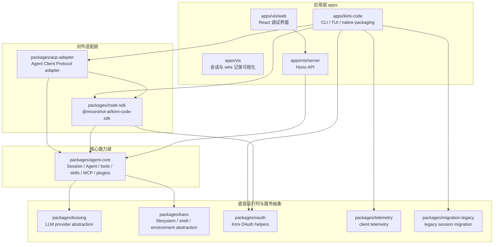
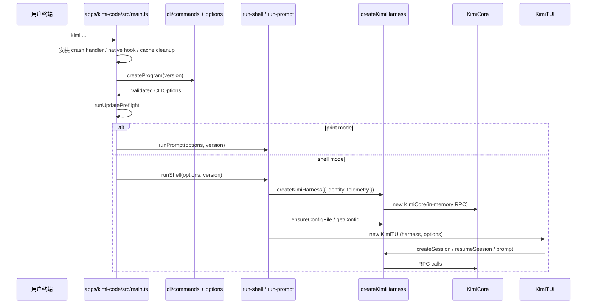
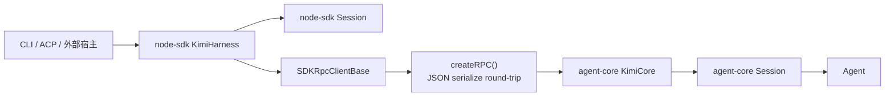
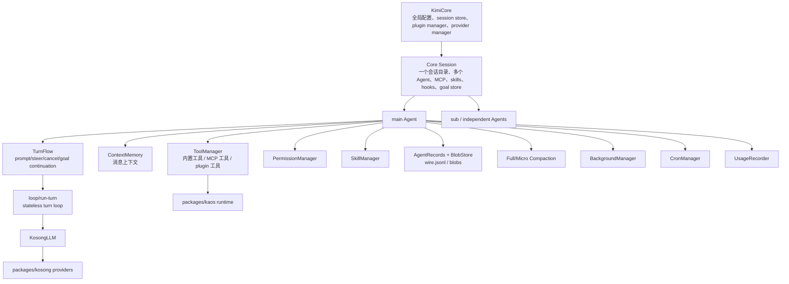
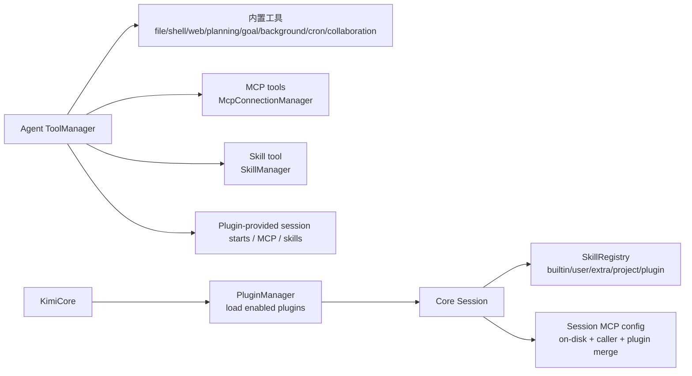
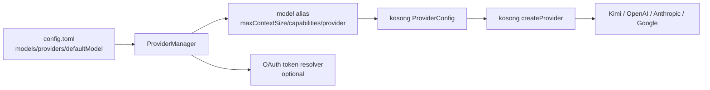
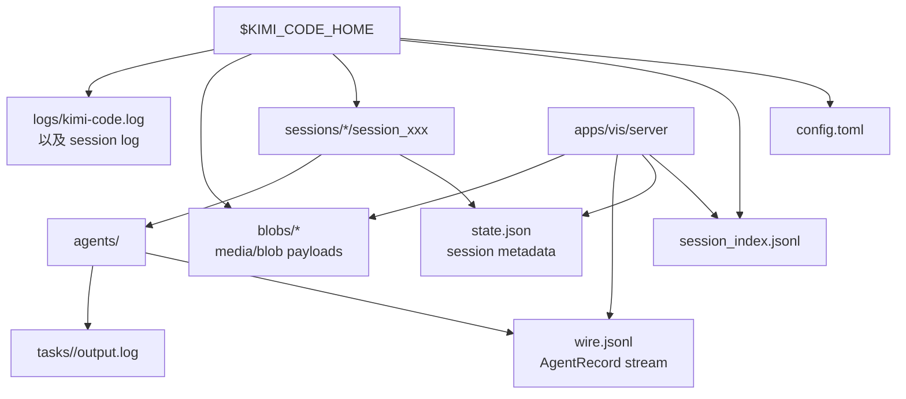
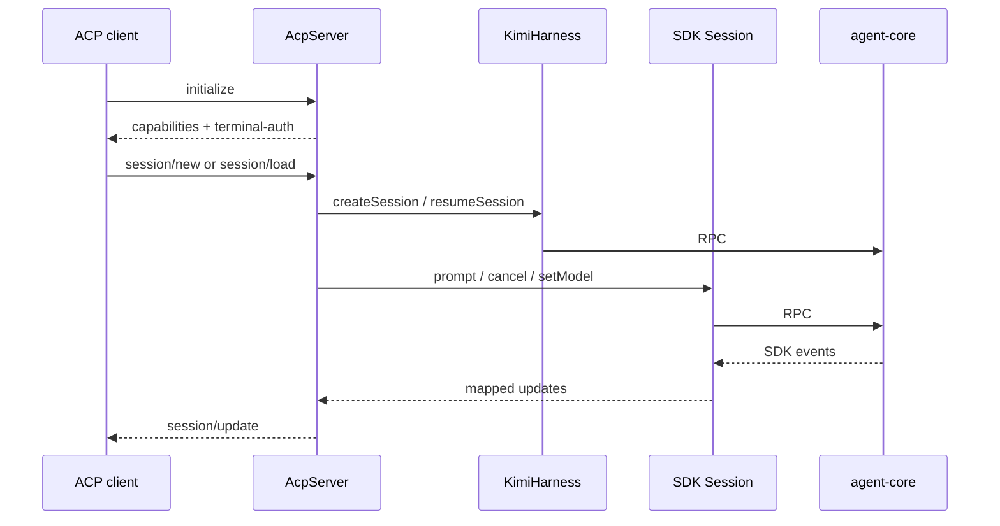

# Kimi Code 架构分析

本文从源码结构和包依赖出发，说明这个仓库的整体架构、运行链路和上手路径。当前仓库是一个 TypeScript monorepo，核心产品是 `apps/kimi-code` 里的 CLI / TUI，核心能力沉在 `packages/agent-core`，对外编程接口由 `packages/node-sdk` 包装。

## 1. 仓库全局视图



最重要的分层关系：

- `apps/kimi-code` 是产品入口，负责命令行参数、TUI、登录、升级、迁移、native 打包等用户可见逻辑。
- `packages/node-sdk` 是 CLI 和其他宿主使用 core 的门面，提供 `KimiHarness`、`Session`、认证 facade、事件与类型。
- `packages/agent-core` 是统一 agent 引擎，管理会话、Agent、模型调用、工具、权限、技能、MCP、插件、记录、压缩、目标模式等。
- `packages/kosong` 只处理 LLM provider 抽象和生成协议，不持有会话概念。
- `packages/kaos` 抽象本地/远端执行环境，给 core 的文件和进程工具提供统一接口。
- `apps/vis` 不驱动 agent，它读 `$KIMI_CODE_HOME` 下的会话记录和 blob，用于调试。
- `packages/acp-adapter` 把 `KimiHarness` 会话映射成 Agent Client Protocol 服务，供外部编辑器/客户端接入。

## 2. 工作区包与职责

| 路径 | 包名 | 主要职责 |
| --- | --- | --- |
| `apps/kimi-code` | `@moonshot-ai/kimi-code` | `kimi` CLI、TUI、print 模式、升级、登录、迁移、native 构建、插件 marketplace 构建。 |
| `apps/vis` | `@moonshot-ai/vis` | 组合调试 server 和 React web 的可视化工具。 |
| `apps/vis/server` | `@moonshot-ai/vis-server` | 读取会话目录、`state.json`、`wire.jsonl`、blob，并暴露 `/api/*`。 |
| `apps/vis/web` | `@moonshot-ai/vis-web` | React 调试界面，展示会话列表、上下文、wire 事件、subagent 树。 |
| `packages/node-sdk` | `@moonshot-ai/kimi-code-sdk` | SDK 门面，把 core 的 RPC 包装成 `KimiHarness` 和 `Session`。 |
| `packages/agent-core` | `@moonshot-ai/agent-core` | Agent 引擎主体，包括 `KimiCore`、core `Session`、`Agent`、turn loop、工具、技能、MCP、插件、持久化。 |
| `packages/kosong` | `@moonshot-ai/kosong` | 模型 provider 和 streaming generate 抽象，支持 Kimi/OpenAI/Anthropic/Google 等 provider。 |
| `packages/kaos` | `@moonshot-ai/kaos` | 执行环境抽象，封装 cwd、文件读写、glob、shell exec、SSH 等。 |
| `packages/oauth` | `@moonshot-ai/kimi-code-oauth` | OAuth token、默认请求头、宿主身份校验。 |
| `packages/telemetry` | `@moonshot-ai/kimi-telemetry` | CLI 侧遥测、crash phase、上下文和 shutdown flush。 |
| `packages/acp-adapter` | `@moonshot-ai/acp-adapter` | ACP server/session、事件转换、模型/模式配置、鉴权桥接。 |
| `packages/migration-legacy` | `@moonshot-ai/migration-legacy` | 从旧版 Kimi CLI 会话迁移到当前会话格式。 |

## 3. CLI 启动链路

`kimi` 的 bin 指向 `apps/kimi-code/dist/main.mjs`，源码入口是 `apps/kimi-code/src/main.ts`。启动流程大致如下：



关键点：

- CLI 不直接依赖 `@moonshot-ai/agent-core`，而是通过 `@moonshot-ai/kimi-code-sdk` 间接访问核心能力。
- `runShell` 负责加载 TUI 配置、解析终端主题、创建 harness、检查迁移计划、初始化 telemetry，然后启动 `KimiTUI`。
- `runPrompt` 是非交互 print 模式，仍走同一套 SDK/core 能力，只是 UI 表达不同。
- `kimi acp` 相关命令通过 `packages/acp-adapter` 暴露 ACP 服务，本质也复用 `KimiHarness`。

## 4. SDK 与 Core 的边界

`packages/node-sdk` 的核心是两个类：

- `KimiHarness`：宿主级门面，管理活跃 SDK `Session`，提供创建/恢复/分叉/导出会话、读写配置、插件、认证和 telemetry 入口。
- SDK `Session`：单个会话的门面，提供 `prompt`、`steer`、`cancel`、`setModel`、`setPermission`、`setPlanMode`、`listSkills`、`listPlugins`、`getContext`、`getUsage` 等方法。

SDK 和 core 之间通过仓库内部的模拟 RPC 连接：



这层 RPC 的作用不是网络传输，而是强制 SDK/core 之间按可序列化 payload 和事件协议通信。这样 CLI、ACP、未来其他宿主都可以复用同一套 SDK 表面，而 core 不需要知道具体 UI。

## 5. Agent Core 内部结构

`packages/agent-core` 可以按三层理解：



### 5.1 `KimiCore`

`KimiCore` 是 core 的总入口，负责：

- 解析和加载 `$KIMI_CODE_HOME`、`config.toml`、运行时配置。
- 创建 `LocalKaos`，把工作目录绑定到会话。
- 创建/恢复/关闭/分叉/导出 session。
- 管理 `SessionStore` 和 `session_index.jsonl`。
- 加载插件，并把插件的 MCP、skills、session start 注入合并进会话。
- 构造 `ProviderManager`，把模型别名解析为 `kosong` provider config。
- 提供 `CoreAPI` 给 SDK 调用。

### 5.2 Core `Session`

Core `Session` 是一个持久化会话单元，通常对应 `$KIMI_CODE_HOME/sessions/.../session_xxx`。它负责：

- 持有 `main` agent，并按需创建/恢复 subagent。
- 加载项目/用户/插件/内置 skills。
- 加载 MCP server，维护 MCP 状态并向 UI 发事件。
- 管理 hooks、goal store、session metadata。
- 在 close 时停止 cron、处理后台任务、flush metadata、关闭 MCP 和日志。

一个 session 内部可以有多个 agent，但 `main` 是默认交互 agent。subagent 的记录、上下文和工具执行也各自隔离在 agent 目录下。

### 5.3 `Agent`

`Agent` 是真正执行一轮对话的对象。它把下面这些子系统组合起来：

- `ContextMemory`：上下文消息。
- `TurnFlow`：接收用户 prompt/steer，驱动 turn loop，处理中断、goal continuation、telemetry。
- `ToolManager`：汇总内置工具、MCP 工具、技能工具、插件工具。
- `PermissionManager`：工具执行权限。
- `PlanMode`：计划模式。
- `SkillManager`：技能激活和模型可见工具。
- `BackgroundManager`：后台任务。
- `CronManager`：定时任务，subagent 不启用。
- `AgentRecords`：写入 wire 事件，用于恢复和调试。
- `FullCompaction` / `MicroCompaction`：上下文压缩。
- `UsageRecorder`：token 和使用量统计。

`Agent` 本身不应该依赖 `Session` 生命周期；它接收 session 提供的可选能力，例如 `subagentHost`、`mcp`、`goals`、`hookEngine`。

## 6. 一轮对话的数据流

```mermaid
sequenceDiagram
  participant UI as TUI / ACP / SDK caller
  participant SDKSession as SDK Session
  participant CoreSession as Core Session RPC
  participant Agent as Agent
  participant TurnFlow as TurnFlow
  participant Loop as runTurn
  participant LLM as KosongLLM
  participant Tools as ToolManager
  participant Store as AgentRecords

  UI->>SDKSession: prompt(input)
  SDKSession->>CoreSession: rpc.prompt({ sessionId, input })
  CoreSession->>Agent: main.turn.prompt(input)
  Agent->>Store: log turn.prompt
  Agent->>TurnFlow: launch turn
  TurnFlow->>Loop: runTurn({ llm, tools, history, hooks })
  Loop->>LLM: stream model response
  LLM->>Loop: text / thinking / tool calls
  Loop->>Tools: execute tool call
  Tools->>Loop: tool result
  Loop->>TurnFlow: step/turn events
  TurnFlow->>Store: record wire events
  TurnFlow->>UI: emit SDK events
```

这里最值得注意的是 `loop/run-turn` 的定位：它是偏无状态的 turn 执行器；会话恢复、记录、权限、工具注册、MCP、技能等状态由 `Agent` 周边系统提供。

## 7. 工具、技能、MCP、插件



内置工具集中在 `packages/agent-core/src/tools/builtin`，包括：

- 文件：`read`、`write`、`edit`、`grep`、`glob`、`read-media`
- shell：`bash`
- web：`fetch-url`、`web-search`
- 协作：`agent`、`ask-user`、`skill-tool`
- 计划/状态/目标：`enter-plan-mode`、`exit-plan-mode`、`todo-list`、`create/get/update-goal`
- 后台和定时：`task-list`、`task-output`、`task-stop`、`cron-create/list/delete`

扩展能力主要有三条路：

- Skill：通过 `SkillRegistry` 被 session 加载，必要时暴露成模型可调用的 `skill-tool`。
- MCP：由 session 加载本地配置、调用方传入配置和插件配置，连接后工具进入 `ToolManager`。
- Plugin：由 `PluginManager` 在 `KimiCore` 层加载，向 session 注入 MCP、skills 或 session start 内容。

## 8. 模型与 Provider 层

模型解析链路如下：



`agent-core` 不直接调用某个供应商 SDK，而是通过 `packages/kosong` 的 `generate` 和 provider 接口。`ProviderManager` 做两件核心事情：

- 把用户配置里的模型别名解析为真实 provider、模型名、上下文窗口、能力矩阵。
- 对启用 OAuth 的 provider 包装请求认证，并在 401 时尝试刷新 token。

这种设计让上层的 `Agent` 只关心“当前模型、能力、工具调用、流式输出”，不关心供应商协议细节。

## 9. 持久化与调试数据

会话持久化大致包括：



`apps/vis/server` 的职责就是安全读取这些记录并提供 API。它不会创建或驱动 agent，而是把已有 session 的状态、wire 事件、上下文投影、subagent 树和 blob 暴露给 `apps/vis/web`。

## 10. TUI 层结构

`apps/kimi-code/src/tui` 是终端 UI。按目录看：

- `kimi-tui.ts`：TUI 主控制器，连接 `KimiHarness` 和 pi-tui 渲染。
- `controllers/*`：把 session 事件、auth flow、streaming UI、键盘、任务浏览等流程拆出来。
- `components/messages/*`：会话消息、tool call、status、plan、usage、MCP/plugin 状态等渲染。
- `components/dialogs/*`：模型选择、权限选择、登录/API key、session picker、plugin selector、settings 等弹窗。
- `commands/*`：TUI slash commands 的解析、注册、分发。
- `reverse-rpc/*`：approval/question 这类 core 反向请求 UI 的桥接。
- `theme/*`：主题探测、颜色、样式和 pi-tui theme。

修改 TUI 时应优先读 `apps/kimi-code/AGENTS.md` 和 `.agents/skills/write-tui/SKILL.md`，因为该目录有专门的交互和视觉规范。

## 11. ACP 与外部客户端接入

`packages/acp-adapter` 的核心是：

- `AcpServer`：实现 `@agentclientprotocol/sdk` 的 agent-side handler。
- `AcpSession`：包装 SDK `Session`，把 Kimi 事件转换成 ACP `session/update`。
- `events-map.ts`：把 assistant delta、thinking、tool call、tool result 等转换成 ACP 内容块。
- `mcp.ts`：把 ACP client 传入的 MCP server 配置转成 core 可理解的配置。

接入链路：



## 12. 上手建议

建议按下面顺序熟悉，不要一开始就从所有工具实现读起：

1. 先读 `apps/kimi-code/src/main.ts` 和 `apps/kimi-code/src/cli/run-shell.ts`，理解 CLI 怎样启动 harness 和 TUI。
2. 读 `packages/node-sdk/src/sdk-rpc-client.ts`、`kimi-harness.ts`、`session.ts`，理解宿主看到的 API。
3. 读 `packages/agent-core/src/rpc/core-impl.ts`，理解 `KimiCore` 怎样创建 session。
4. 读 `packages/agent-core/src/session/index.ts`，理解一个 core session 里如何加载 skills、MCP、agent、metadata。
5. 读 `packages/agent-core/src/agent/index.ts` 和 `packages/agent-core/src/agent/turn/index.ts`，理解 Agent 的组合方式和 turn 执行入口。
6. 再读 `packages/agent-core/src/loop/run-turn.ts`，理解模型流式输出与工具调用循环。
7. 需要改模型配置时读 `packages/agent-core/src/session/provider-manager.ts` 和 `packages/kosong/src/providers/*`。
8. 需要改 TUI 时读 `apps/kimi-code/src/tui/kimi-tui.ts`、`controllers/session-event-handler.ts`、`components/messages/*`、`commands/registry.ts`。
9. 需要调试历史会话时跑 `pnpm vis`，同时读 `apps/vis/server/src/lib/session-store.ts` 和 `apps/vis/web/src/pages/*`。

## 13. 常见修改点索引

| 需求 | 优先看哪里 |
| --- | --- |
| 新增 CLI 参数或子命令 | `apps/kimi-code/src/cli/commands.ts`、`apps/kimi-code/src/cli/options.ts`、`apps/kimi-code/src/main.ts` |
| 改 TUI slash command | `apps/kimi-code/src/tui/commands/*` |
| 改消息或工具渲染 | `apps/kimi-code/src/tui/components/messages/*` |
| 新增 core RPC 能力 | `packages/agent-core/src/rpc/core-api.ts`、`core-impl.ts`、`packages/node-sdk/src/rpc.ts`、`packages/node-sdk/src/session.ts` |
| 新增内置工具 | `packages/agent-core/src/tools/builtin/*`、`packages/agent-core/src/agent/tool/*` |
| 改权限逻辑 | `packages/agent-core/src/agent/permission/*` |
| 改模型/provider 配置 | `packages/agent-core/src/session/provider-manager.ts`、`packages/kosong/src/providers/*` |
| 改会话持久化/恢复 | `packages/agent-core/src/session/store/*`、`packages/agent-core/src/agent/records/*`、`packages/agent-core/src/session/index.ts` |
| 改 skills 加载 | `packages/agent-core/src/skill/*`、`packages/agent-core/src/agent/skill/*` |
| 改 MCP | `packages/agent-core/src/mcp/*` |
| 改插件 | `packages/agent-core/src/plugin/*`、`apps/kimi-code/src/tui/commands/plugins.ts` |
| 改 ACP 支持 | `packages/acp-adapter/src/server.ts`、`session.ts`、`events-map.ts` |
| 改可视化调试 | `apps/vis/server/src/routes/*`、`apps/vis/web/src/components/*` |

## 14. 架构原则总结

这个项目的核心设计是“宿主界面与 agent 引擎分离”：

- CLI/TUI 负责用户体验，不拥有 agent 执行细节。
- SDK 是稳定门面，隔离宿主和 core。
- Core session/agent 负责状态、工具、权限、技能、MCP 和记录。
- Turn loop 尽量保持无状态，便于测试和复用。
- LLM provider 统一落在 `kosong`，执行环境统一落在 `kaos`。
- 持久化 wire 事件既用于恢复，也用于 `vis` 调试。

因此，判断一个改动应该放哪里，可以先问三个问题：

1. 这是用户界面行为吗？优先在 `apps/kimi-code` 或 `apps/vis`。
2. 这是 agent 执行语义、工具、权限、会话状态吗？优先在 `packages/agent-core`。
3. 这是模型供应商或执行环境适配吗？优先在 `packages/kosong` 或 `packages/kaos`。

